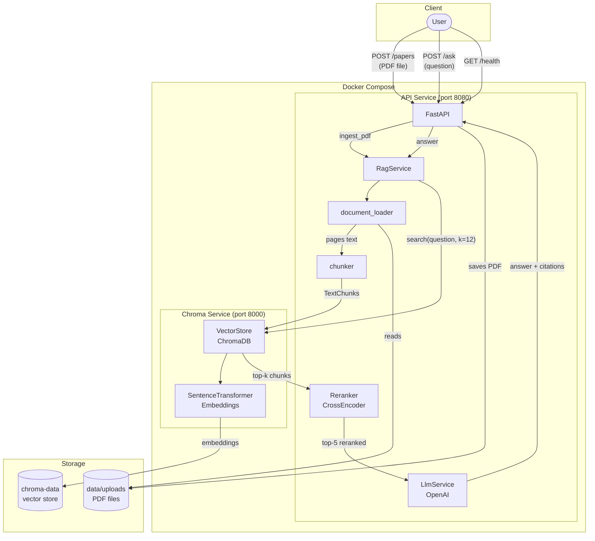

# Research Paper Assistant

A personal retrieval-augmented generation assistant for asking questions about research papers you upload.

The app ingests PDF papers, chunks their pages, stores dense embeddings in ChromaDB, retrieves relevant passages for a question, reranks the evidence with a cross-encoder, and generates citation-aware answers grounded in the retrieved text.

## Current MVP

- FastAPI API service
- PDF upload and text extraction with `pypdf`
- Page-aware chunking for citations
- ChromaDB vector storage
- Sentence-transformer embeddings
- Cross-encoder reranking
- OpenAI-compatible answer generation layer
- Docker Compose setup

## Architecture



**Ingestion flow** (`POST /papers`): PDF → text extraction (pypdf, page-aware) → overlapping chunks → embeddings → ChromaDB upsert.

**Query flow** (`POST /ask`): question → semantic search (k=12) → cross-encoder reranking (top 5) → OpenAI answer with inline citations.

## Project Structure

```text
app/
  main.py                 FastAPI routes
  config.py               Environment-based settings
  schemas.py              Request and response models
  services/
    chunker.py            Text chunking
    document_loader.py    PDF extraction
    vector_store.py       Chroma retrieval
    reranker.py           Cross-encoder reranking
    llm.py                LLM answer generation
    rag.py                End-to-end RAG orchestration
tests/
  test_chunker.py
```

## Setup

Create your environment file:

```powershell
Copy-Item .env.example .env
```

Add your API key to `.env`:

```text
OPENAI_API_KEY=your_api_key_here
```

Run with Docker:

```powershell
docker compose up --build
```

The API will be available at:

```text
http://localhost:8080
```

Interactive API docs:

```text
http://localhost:8080/docs
```

## API

Upload a paper:

```powershell
curl.exe -X POST "http://localhost:8080/papers" -F "file=@paper.pdf"
```

Ask a question:

```powershell
curl.exe -X POST "http://localhost:8080/ask" -H "Content-Type: application/json" -d '{\"question\":\"What is the main contribution of the paper?\"}'
```

## Roadmap

1. Add paper metadata extraction for title, authors, year, and DOI.
2. Add a simple web UI for uploading PDFs and chatting with citations.
3. Add conversation history.
4. Add evaluation tests for retrieval quality.
5. Add support for multiple collections or projects.
